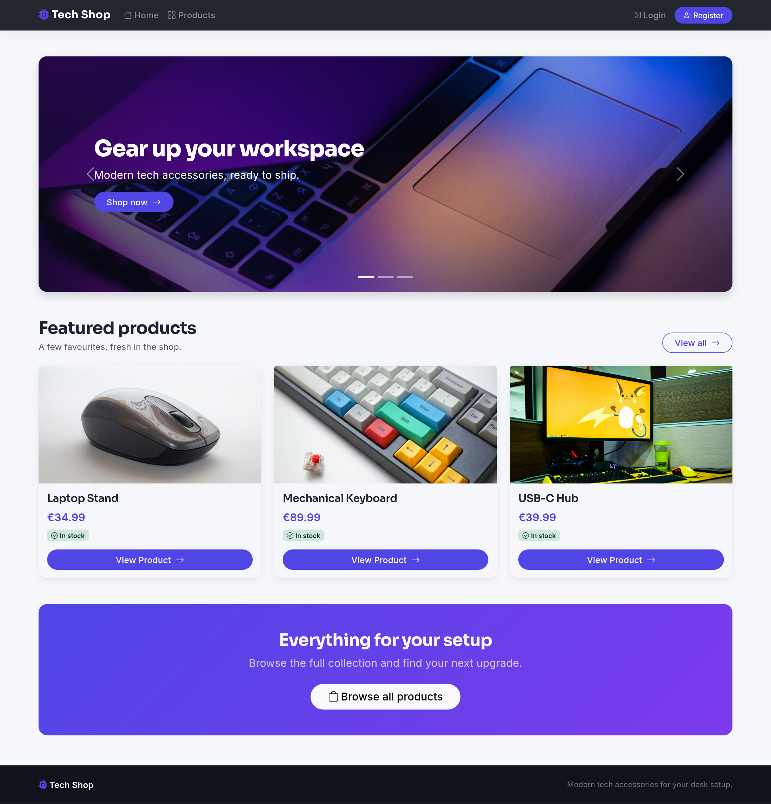
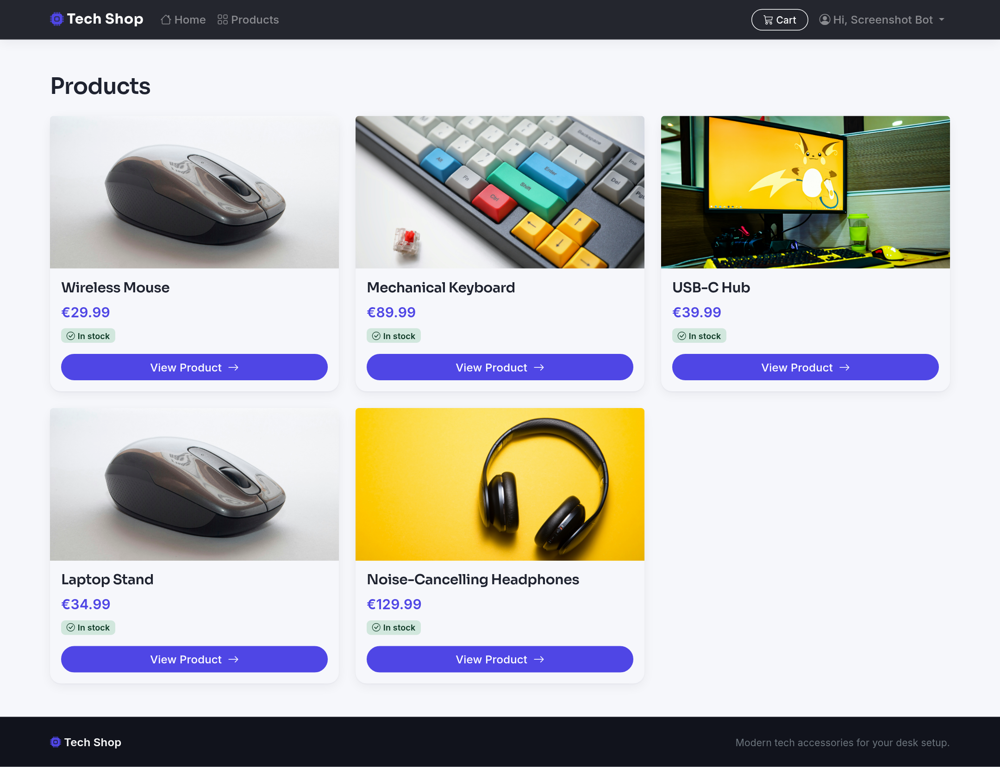
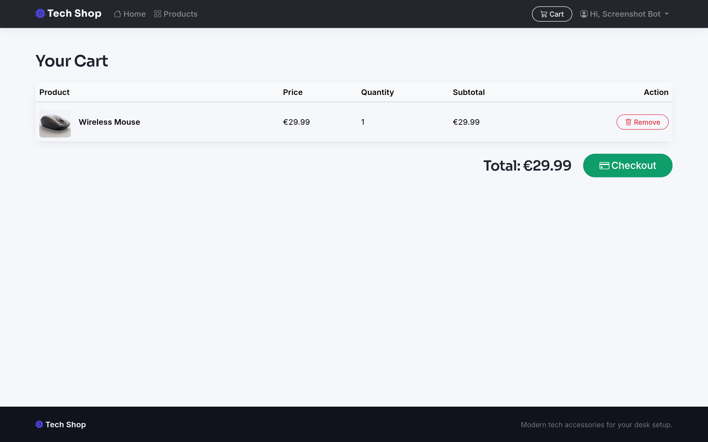
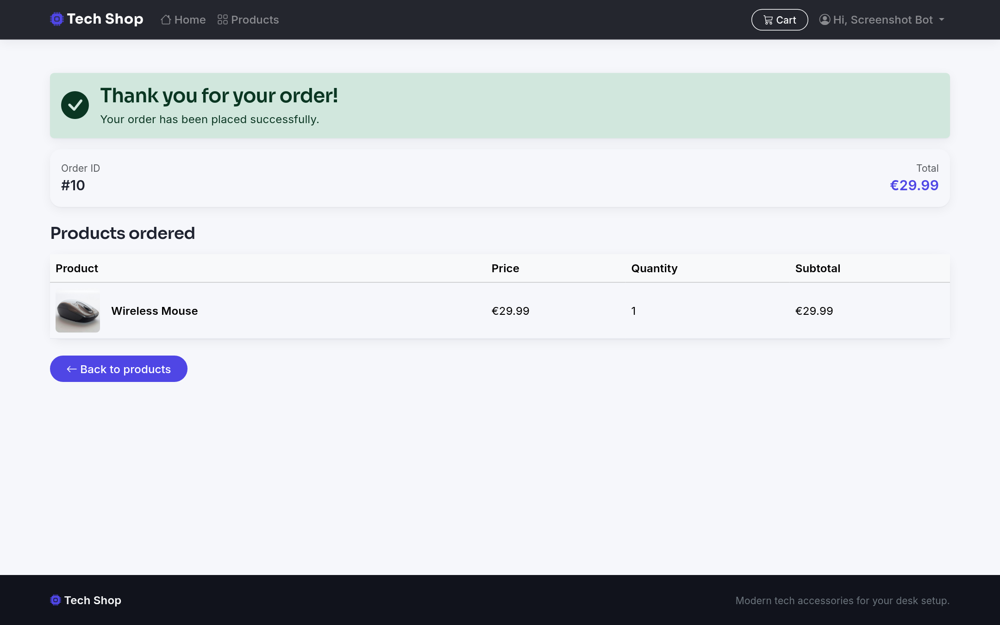

# Express Tech Shop

A small full-stack e-commerce app for desk tech accessories. You can browse
products, manage a cart, check out, and view your order history. It is built
with Express, EJS, and PostgreSQL (hosted on [Neon](https://neon.tech)).

## Screenshots

| Landing page | Products |
| --- | --- |
|  |  |

| Cart | Order confirmation |
| --- | --- |
|  |  |

## Features

- Register, login, and logout with hashed passwords (`bcrypt`) and session
  cookies (`express-session`).
- Product grid and detail pages that show live stock status.
- Cart where you can add, view, and remove items. There is one cart row per
  user and product.
- Checkout that creates an order and its line items, reduces product stock, and
  clears the cart. It all runs inside one database transaction. Stock is checked
  first and guarded so it can never go below zero.
- Order confirmation page with an animated success check, plus an order history
  list for the logged-in user.
- Bootstrap 5 interface with a custom theme (Inter and Sora fonts, indigo
  accent), Bootstrap Icons, a hero carousel, and featured products from the
  database.

## Tech stack

- Node.js (ES modules)
- Express 5
- EJS views with Bootstrap 5 and Bootstrap Icons (from a CDN)
- PostgreSQL on Neon, accessed with the `pg` package
- `express-session` and `bcrypt` for auth
- `nodemon` for development

## Project structure

```
.
├── app.js                  # App entry: middleware, static assets, routes
├── db/
│   ├── index.js            # pg connection pool (uses DATABASE_URL)
│   └── schema.sql          # Table definitions
├── middleware/
│   └── requireAuth.js      # Redirects guests to /auth/login
├── routes/                 # auth, products, cart, checkout, orders
└── views/
    ├── css/style.css       # Custom theme (served at /css)
    ├── images/             # Static images (served at /images)
    ├── partials/           # header, navbar, footer
    └── pages/              # home, products, cart, orders, ...
```

## Database (Neon)

This project uses a Neon Postgres database. The connection is set up in
[`db/index.js`](db/index.js) and expects a `DATABASE_URL` with SSL.

### 1. Create the database

1. Create a project at [neon.tech](https://neon.tech).
2. Copy the connection string from the Neon dashboard. It looks like this:
   ```
   postgresql://<user>:<password>@<endpoint>.<region>.aws.neon.tech/<db>?sslmode=require
   ```

### 2. Create the tables

Run the schema against your Neon database, using the Neon SQL Editor or `psql`:

```bash
psql "$DATABASE_URL" -f db/schema.sql
```

Schema overview:

```sql
users        (id, name, email[unique], password_hash, created_at)
products     (id, name, description, price, image_url, category, stock, created_at)
cart_items   (id, user_id -> users, product_id -> products, quantity, created_at,
              UNIQUE(user_id, product_id))
orders       (id, user_id -> users, total, status, created_at)
order_items  (id, order_id -> orders, product_id -> products, quantity, price)
```

All foreign keys use `ON DELETE CASCADE`. See [`db/schema.sql`](db/schema.sql)
for the full definitions.

Note: the app reads products from the database but does not seed them. Add a few
rows to `products` (name, price, image_url, category, stock) so the catalog is
not empty.

## Getting started

```bash
# 1. Clone and install
git clone https://github.com/ACoci86/express-tech-shop.git
cd express-tech-shop
npm install

# 2. Configure environment
cp .env.example .env
# then edit .env with your Neon connection string and a session secret

# 3. Create the tables (see the Database section)
psql "$DATABASE_URL" -f db/schema.sql

# 4. Run
npm run dev      # development, auto-reload via nodemon
# or
npm start        # production
```

The app runs at http://localhost:3000 (or the `PORT` in your `.env`).

## Environment variables

| Variable | Description |
| --- | --- |
| `DATABASE_URL` | Neon Postgres connection string (with `sslmode=require`) |
| `SESSION_SECRET` | Secret used to sign session cookies |
| `PORT` | Port to listen on (optional, defaults to 3000) |

The `.env` file is git-ignored. Do not commit your real credentials.

## Available scripts

| Command | Description |
| --- | --- |
| `npm run dev` | Start with `nodemon` (auto-reload) |
| `npm start` | Start with `node` |

## License

ISC
